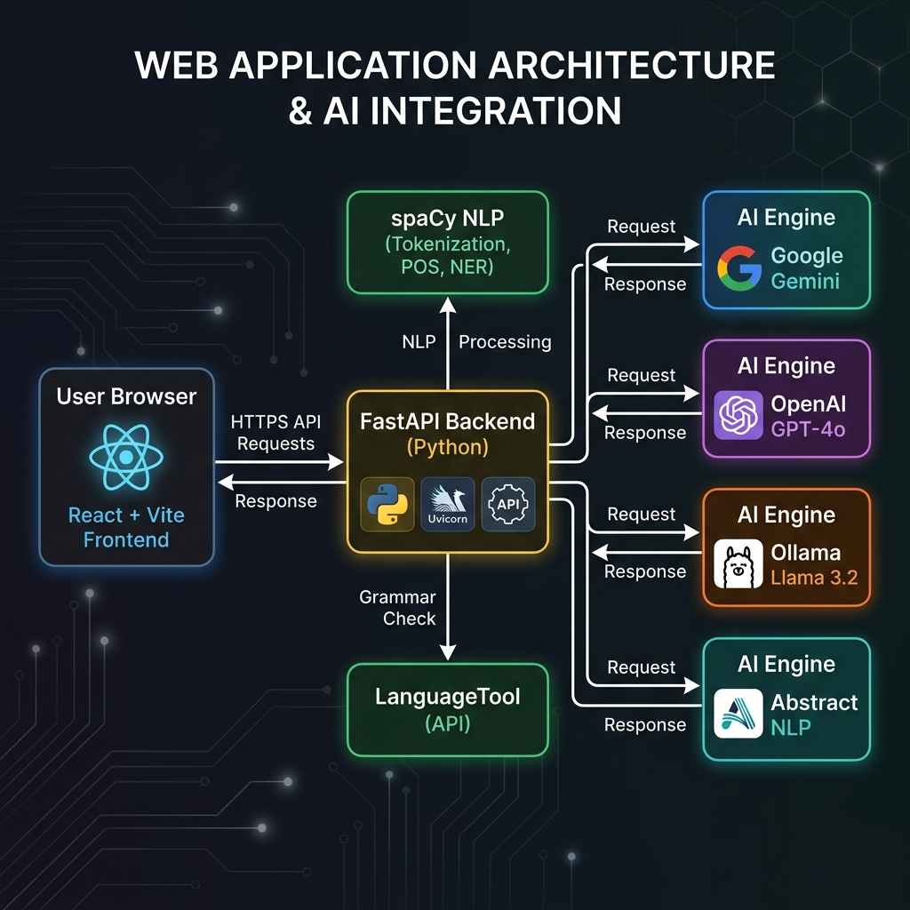

<div align="center">


# 🧠 Parthi AI: Email Formation

**A real-time, AI-powered writing and email polishing tool with a 4-engine AI pipeline.**

[](https://fastapi.tiangolo.com/)
[](https://react.dev/)
[](https://python.org/)
[](https://docs.docker.com/)
[](LICENSE)

[🚀 Quick Start](#-quick-start) · [🐳 Docker](#-docker-setup) · [🏗️ Architecture](#%EF%B8%8F-architecture) · [✨ Features](#-features) · [☁️ Deploy](#%EF%B8%8F-deploy-to-render)

</div>

---

## 📖 Overview

**Parthi AI: Email Formation** transforms rough, unpolished drafts into professional, high-quality communication — instantly. It uses a **multi-engine AI pipeline** to give you the best possible rewrite, choosing between cloud LLMs and local NLP based on your preference.

Whether you're writing a quick status update or a formal business proposal, just paste your draft and get a polished result in seconds — with full reasoning for every change made.

---

## ✨ Features

| Feature | Description |
|---|---|
| 🔄 **4-Engine AI Pipeline** | Switch between Gemini, OpenAI, Ollama (local), and Elite Hybrid NLP |
| 🎨 **5 Tone Styles** | Professional, Casual, Friendly, Concise, Creative |
| ⚡ **Real-time Analysis** | Auto-analyzes as you type with 1.5s debounce |
| 📊 **Readability Metrics** | Flesch-Kincaid grade, reading ease score, word count |
| 🔍 **Grammar Checking** | Deep grammar & passive voice detection via LanguageTool + spaCy |
| 💬 **Smart Rewrites** | Full document rewrite with AI reasoning for every decision |
| 🌑 **Dark Mode UI** | Premium dark-mode interface — feels like a pro writing tool |
| 🔁 **Smart Fallback** | If a cloud engine fails, automatically falls back to Hybrid NLP |

---

## 🏗️ Architecture



```
┌─────────────────────────────────────────────────────────────────┐
│                        USER BROWSER                             │
│              React 19 + Vite + Axios (Port 3000)                │
└──────────────────────────┬──────────────────────────────────────┘
                           │ HTTP POST /analyze
                           ▼
┌─────────────────────────────────────────────────────────────────┐
│                    FASTAPI BACKEND (Port 8001)                   │
│                                                                  │
│  ┌─────────────┐  ┌─────────────┐  ┌───────────────────────┐   │
│  │  spaCy NLP  │  │LanguageTool │  │   Readability Engine   │   │
│  │ (en_core_   │  │  (Grammar)  │  │  (textstat lib)        │   │
│  │  web_sm)    │  └─────────────┘  └───────────────────────┘   │
│  └─────────────┘                                                 │
│                                                                  │
│              ┌──────── AI ENGINE ROUTER ────────┐               │
│              │                                   │               │
│     ┌────────▼──────┐              ┌─────────────▼────────┐    │
│     │  Cloud Engines │              │   Local Engines       │    │
│     │                │              │                       │    │
│     │ 🔵 Google Gemini│              │ 🟢 Ollama Llama 3.2  │    │
│     │ 🟡 OpenAI GPT-4o│              │ 🔴 Elite Hybrid NLP  │    │
│     └───────────────┘              └───────────────────────┘    │
└─────────────────────────────────────────────────────────────────┘
```

### Engine Comparison

| Engine | Speed | Quality | Cost | Offline |
|--------|-------|---------|------|---------|
| 🔴 Elite Hybrid NLP | ⚡ Instant | Good | Free | ✅ Yes |
| 🟢 Ollama (Llama 3.2) | 🐢 Slow | Very Good | Free | ✅ Yes |
| 🔵 Google Gemini | ⚡ Fast | Excellent | 💰 API | ❌ No |
| 🟡 OpenAI GPT-4o | ⚡ Fast | Excellent | 💰 API | ❌ No |

---

## 🚀 Quick Start

### Prerequisites
- Python 3.11+
- Node.js 18+
- Java (for LanguageTool grammar engine)

### 1. Clone the Repository
```bash
git clone https://github.com/parthibanktech/parthi-ai-email-formation.git
cd parthi-ai-email-formation
```

### 2. Backend Setup
```bash
cd backend

# Install Python dependencies
pip install -r requirements.txt

# Download spaCy language model
python -m spacy download en_core_web_sm

# Set up environment variables
cp .env.example .env
# Edit .env with your API keys

# Start the server
python main.py
# ✅ API running at http://localhost:8001
```

### 3. Frontend Setup
```bash
cd email_frontend

# Install dependencies
npm install

# Start dev server
npm run dev
# ✅ UI running at http://localhost:5173
```

---

## 🔑 Environment Variables

Create `backend/.env` from the example:

```bash
cp backend/.env.example backend/.env
```

| Variable | Required | Description |
|----------|----------|-------------|
| `GEMINI_API_KEY` | Optional | Google Gemini API key |
| `OPENAI_API_KEY` | Optional | OpenAI API key |

> 💡 **No API keys needed** to use the app! The Elite Hybrid NLP and Ollama engines work entirely offline and for free.

---

## 🐳 Docker Setup

Run the entire stack with a **single command**:

```bash
docker compose up --build
```

| Service | URL | Description |
|---------|-----|-------------|
| 🌐 Frontend | http://localhost:3000 | React UI served by Nginx |
| ⚙️ Backend | http://localhost:8001 | FastAPI REST API |
| 🤖 Ollama | http://localhost:11434 | Local LLM server |

### Docker Architecture
```
docker-compose.yml
├── backend/         → Python 3.11 + FastAPI + spaCy + LanguageTool
├── email_frontend/  → Node build → Nginx static serve
└── ollama/          → Local Llama 3.2 LLM (optional)
```

To stop everything:
```bash
docker compose down
```

---

## ☁️ Deploy to Render

This project ships with a `render.yaml` blueprint for one-click cloud deployment:

1. Push to GitHub *(already done!)*
2. Log in to [Render](https://render.com/)
3. Click **New + → Blueprint**
4. Connect your GitHub repo
5. Add your API keys as environment variables
6. 🚀 Deploy!

Render auto-detects and sets up both Backend and Frontend services.

---

## 🛠️ Tech Stack

### Backend
- **[FastAPI](https://fastapi.tiangolo.com/)** — High-performance async REST API
- **[spaCy](https://spacy.io/)** — Industrial-strength NLP (NER, dependency parsing)
- **[LanguageTool](https://languagetool.org/)** — Grammar & style checking
- **[textstat](https://github.com/textstat/textstat)** — Readability scoring
- **[Google Generative AI](https://ai.google.dev/)** — Gemini Pro integration
- **[OpenAI Python SDK](https://github.com/openai/openai-python)** — GPT-4o integration
- **[httpx](https://www.python-httpx.org/)** — Async HTTP for Ollama

### Frontend
- **[React 19](https://react.dev/)** — UI framework
- **[Vite](https://vite.dev/)** — Lightning-fast build tool
- **[Axios](https://axios-http.com/)** — HTTP client
- **[Lucide React](https://lucide.dev/)** — Icon library

### Infrastructure
- **[Docker + Compose](https://docs.docker.com/)** — Containerized deployment
- **[Nginx](https://nginx.org/)** — Frontend reverse proxy
- **[Ollama](https://ollama.com/)** — Local LLM runtime
- **[Render](https://render.com/)** — Cloud hosting

---

## 📁 Project Structure

```
parthi-ai-email-formation/
├── backend/
│   ├── main.py              # FastAPI app, all endpoints & AI engines
│   ├── requirements.txt     # Python dependencies
│   ├── Dockerfile           # Backend container
│   └── .env.example         # Environment variable template
├── email_frontend/
│   ├── src/
│   │   ├── App.jsx          # Main React component
│   │   └── index.css        # Premium dark-mode styles
│   ├── Dockerfile           # Frontend container (multi-stage)
│   ├── nginx.conf           # Nginx SPA + API proxy config
│   └── package.json
├── docs/
│   └── images/              # README assets
├── docker-compose.yml       # Full-stack orchestration
├── render.yaml              # Render.com deployment blueprint
└── HOW_TO_RUN.md            # Detailed local setup guide
```

---

## 🤝 Contributing

1. Fork the repository
2. Create a feature branch: `git checkout -b feature/amazing-feature`
3. Commit your changes: `git commit -m 'Add amazing feature'`
4. Push to the branch: `git push origin feature/amazing-feature`
5. Open a Pull Request

---

## 👨‍💻 Author

**Parthiban** — [@parthibanktech](https://github.com/parthibanktech)

---

<div align="center">

⭐ **Star this repo if it helped you!** ⭐

Made with ❤️ by Parthiban

</div>
